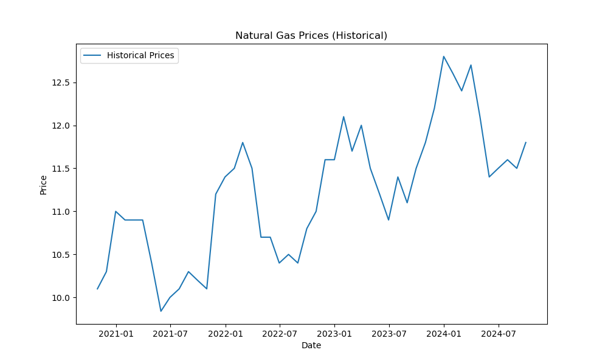
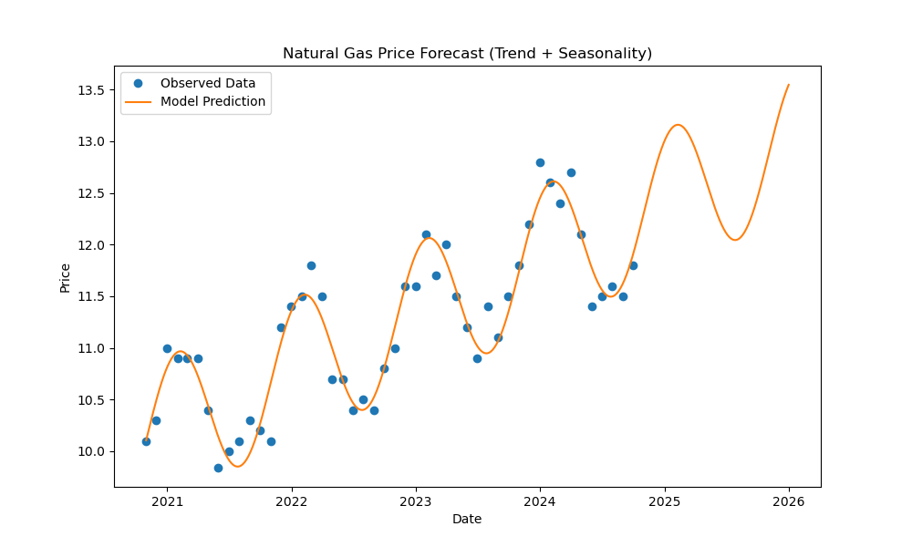
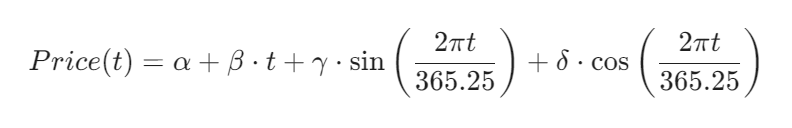

# Natural Gas Price Prediction & Contract Valuation

This project implements a time-series forecasting model for natural gas prices and a logic engine for valuing gas storage contracts. It is designed to capture both long-term market trends and annual seasonal cycles (e.g., winter demand spikes).

## Project Overview

The core objective is to allow traders to:

1. **Forecast Prices:** Predict the price of natural gas for any specific date in the future.
2. **Value Contracts:** Calculate the profitability of a storage contract, accounting for buying (injection), storing, and selling (withdrawal) strategies.

## Results
```text
Trade: Inject 2024-06-15 @ $11.66 -> Withdraw 2024-10-15 @ $12.09
       Volume: 50000 units | Duration: 122 days | Profit: $-8,983.47

Trade: Inject 2024-11-15 @ $12.50 -> Withdraw 2025-01-15 @ $13.10
       Volume: 50000 units | Duration: 61 days | Profit: $14,737.14

Total Contract Value: $5,753.67
```
- Assume a user is considering buying 50,000 units on 15th June 2024 and selling on 15th October 2024, and buying 50,000 units on 15th November 2024 and selling on 15th January 2025.
- The model predicts gas prices at future dates, calculates trading income, subtracts the cost of storage and gives a profit/loss prediction for each trade.
- This would help a user predict profitable trades.
  
### Historical Prices

### Seasonal Forecast


## Methodology

### 1. The Pricing Model (Trend + Seasonality)

Standard linear regression often fails with commodities because it ignores cycles. This model improves accuracy by fitting a combined equation that accounts for both the linear trend and the sinusoidal seasonal pattern simultaneously.

**The Equation:**


* t: Time (days since start).
* β: The long-term price trend (inflation/market shift).
* sin/cos: The annual seasonal oscillation (winter vs. summer).

### 2. Contract Valuation Logic

The valuation engine calculates the net profit of a storage contract. Unlike simpler models, this implementation respects **physical constraints**:

* **Injection/Withdrawal Rates:** Limits the volume of gas traded in a single day based on pump rates (e.g., you cannot fill a 1,000,000 unit facility in one day if the rate is 50,000/day).
* **Storage Costs:** Accounts for the daily cost of holding inventory.
* **Capacity Limits:** Ensures total volume never exceeds the facility's maximum.

## Key Improvements Over Basic Scripts

* **Simultaneous Regression:** Fits trend and seasonality together rather than sequentially. This prevents the model from mistaking a seasonal price hike for a permanent trend.
* **Constraint Checking:** The contract valuation logic now automatically caps trade volumes at the `injection_rate` or `withdrawal_rate` limits, preventing physically impossible profit calculations.
* **Dynamic Dates:** The model is not hardcoded to a specific start year; it auto-detects the timeline from the input CSV.

## Dependencies

* `pandas` (Data handling)
* `numpy` (Mathematical operations)
* `scikit-learn` (Linear Regression)
* `matplotlib` (Visualisation)

## Usage Example

```python
import pandas as pd
from gas_price_predictor import PricePredictor, calculate_contract_value

# 1. Initialise and Train
# Ensure 'Nat_Gas.csv' is in your working directory
predictor = PricePredictor('Nat_Gas.csv')

# 2. Predict a Future Price
future_date = '2025-12-15'
price = predictor.predict_price(future_date)
print(f"Predicted Price on {future_date}: ${price:.2f}")

# 3. Calculate Contract Value
# Define the physical parameters of the facility
injection_dates = [pd.Timestamp('2024-06-01')]
withdrawal_dates = [pd.Timestamp('2024-12-01')]
inj_rate = 50000       # units/day
with_rate = 70000      # units/day
max_vol = 1000000      # max storage
cost_per_day = 0.01    # storage cost

value = calculate_contract_value(
    injection_dates, withdrawal_dates,
    inj_rate, with_rate, max_vol, cost_per_day
)

print(f"Contract Value: ${value:,.2f}")

```
## 📄 License
Copyright © 2026 Sajid Ahmed. All Rights Reserved.

This repository is intended solely for portfolio review and recruitment purposes. By accessing this repository, you acknowledge the following terms:
- View Only: Permission is granted to view the source code for the purpose of evaluating my professional skills and experience.
- No Unauthorised Use: No permission is granted to copy, modify, distribute, or use this code for any personal, commercial, or educational project.
- No AI Training: Use of this source code for the purpose of training machine learning models or generative AI is strictly prohibited.
