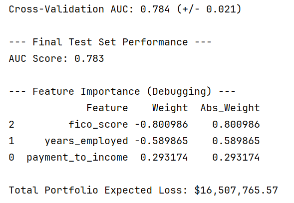
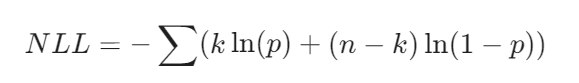

# Loan Default Estimation Projects

This repository contains two distinct approaches to estimating loan default risk.

1. **Machine Learning Approach (Logistic Regression):** A supervised model to predict the probability of default for individual borrowers, including expected loss calculations.
2. **Statistical Approach (Maximum Likelihood Estimation):** An optimisation script to determine the ideal FICO score "buckets" for segmenting customers into risk pools.

---

## Project 1: Logistic Regression Model (`LoanDefaultPredictor`)

This module builds a pipeline to predict default probabilities based on borrower financial data. It addresses common issues in financial modelling, such as class imbalance (defaults are rare) and feature scaling.

### Key Features

* **Standardised Pipeline:** Automatically scales features using `StandardScaler`. This prevents high-magnitude variables (like Income) from overpowering ratio-based variables (like Debt-to-Income).
* **Stratified Validation:** Uses `StratifiedKFold` to ensure that rare default cases are evenly distributed across training and test sets.
* **Financial Context:** Goes beyond accuracy by calculating **Expected Loss (EL)**:

### *EL = PD x LGD x EAD*
*(Probability of Default × Loss Given Default × Exposure at Default)*

### ROC curve
This curve shows the **Receiver Operating Characteristic ** curve, which illustrates how well my model distinguishes between "Good Loans" and "Bad Loans" (Defaults) as I adjust my strictness level.


### Results
- AUC represents the model's accuracy (it correctly predicts 78% of test cases). This level of accuracy is in line with good models in real-world financial usage.
- The Feature Importance scores illustrate how much a given dataset contributes to the model's training. This was used to decide which features to omit from the training to create a realistic model, since the initial model had an accuracy of 100% due to the unrealistic nature of the loan data.
- Total Portfolio Expected Loss estimates how much money is at risk of being lost by the bank.
  


### Usage

```python
from loan_predictor import LoanDefaultPredictor

# Initialise and train the model
predictor = LoanDefaultPredictor('Loan_Data.csv')
predictor.train()

# Debugging: Check which features are driving the decisions
predictor.check_feature_importance()

# Calculate the monetary risk for the portfolio
predictor.predict_expected_loss()

```

### Feature Weights Debugging (The "Toy Data" Issue)

During development, the model initially achieved an AUC of **1.00** (perfect accuracy). This is practically impossible in real-world finance and indicates that the dataset (`Loan_Data.csv`) was synthetic "toy data" generated by simple rules.

We implemented a `check_feature_importance()` method to reverse-engineer these rules:

1. **Phase 1 (AUC = 1.00):** The feature `credit_lines_outstanding` had an abnormally high weight (**~6.5**), suggesting a rule like *"If credit lines > X, Default = True"*.
2. **Phase 2 (AUC = 0.999):** Removing the first feature caused the model to pivot to `debt_to_income` (weight **~3.3**), revealing a secondary rule.
3. **Phase 3 (AUC = 0.783):** Removing both "cheat" features forced the model to learn from realistic, noisy indicators like `fico_score` and `years_employed`.

**Recommendation:** For realistic modelling, exclude `credit_lines_outstanding` and `debt_to_income` if using the standard synthetic `Loan_Data.csv`.

---

## Project 2: Maximum Likelihood Estimation (`DefaultLikelihoodOptimizer`)

This script solves a segmentation problem: *How should we group FICO scores (300-850) to best differentiate between low-risk and high-risk borrowers?*

It uses **Maximum Likelihood Estimation (MLE)** to find the optimal cut-off points for these buckets.

### Key Features

* **Vectorised Lookups:** Instead of iterating through thousands of rows, the script builds a **Cumulative Sum (Prefix Sum) Table**. This allows it to calculate the default rate for any FICO range in  time, speeding up optimisation by orders of magnitude.
* **Derivative-Free Optimisation:** Uses the **Powell** method instead of gradient-based methods (L-BFGS-B). This is crucial because FICO scores are integers (discrete), meaning the "slope" of the function is often zero or undefined.
* **Log-Likelihood Calculation:** Optimises boundaries by minimising the Negative Log-Likelihood:




*Where k is defaults in the bucket, n is total loans, and p is the probability.*

### Usage

```python
from likelihood_optimizer import DefaultLikelihoodOptimizer

# Initialize
optimizer = DefaultLikelihoodOptimizer('Loan_Data.csv')

# Find the best 10 cut-off points for FICO scores
result = optimizer.optimize_segmentation(num_points=10)

print(f"Optimal Log-Likelihood: {-result.fun}")
print(f"Suggested FICO Thresholds: {sorted(result.x)}")

```

---

## Requirements

* Python 3.8+
* `pandas` & `numpy` (Data manipulation)
* `scikit-learn` (Machine Learning models)
* `scipy` (Optimisation algorithms)
* `matplotlib` & `seaborn` (Visualisation)

Install dependencies via:

```bash
pip install pandas numpy scikit-learn scipy matplotlib seaborn

```
